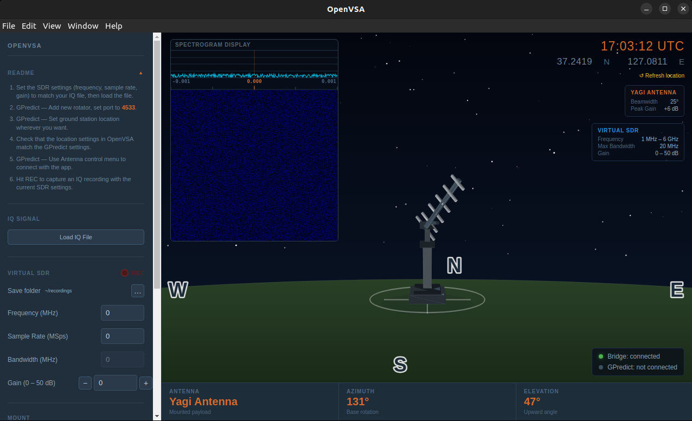

<p align="center">
  
</p>

<h1 align="center">OpenVSA</h1>

<p align="center"><strong>Open Virtual Satellite Antenna</strong> — A virtual antenna simulator with 3D visualization, GPredict integration, and SDR waterfall display.</p>

Load IQ signal files, point your antenna with GPredict, and visualize RF reception in real time.

## Features

- **3D Antenna Visualization** — Real-time rendered yagi, dish, dipole, and helix antennas with azimuth/elevation control
- **GPredict Integration** — Connects via Hamlib rotctld protocol (TCP port 4533) for live antenna tracking
- **SDR Display** — FFT spectrum analyzer and waterfall plot from loaded IQ files
- **Signal Recording** — Capture IQ data with SigMF metadata export
- **Multiple Antenna Types** — Switch between yagi, parabolic dish, dipole, and helix with accurate beam patterns

## Screenshot

<p align="center">
  
</p>

## Getting Started

### Prerequisites

- [Node.js](https://nodejs.org/) (v18+)
- [GPredict](http://gpredict.oz9aec.net/) (optional, for antenna tracking)

### Install & Run

```bash
git clone https://github.com/whal-e3/OpenVSA
cd OpenVSA
npm install
npm run electron
```

### Connect GPredict

1. In GPredict, go to **Edit > Preferences > Interfaces > Rotators**
2. Add a new rotator with host `localhost` and port `4533`
3. OpenVSA will receive azimuth/elevation commands automatically

## Architecture

```
GPredict ──► TCP:4533 ──► server.js ──► WS:4534 ──► Renderer
             rotctld       bridge        internal     (3D + UI)

.cf32 file ──► Load IQ ──► FFT ──► Spectrum + Waterfall
```

## Tech Stack

- **Electron** — Desktop runtime
- **Vanilla JS** — No frameworks, no bundler
- **Custom 3D engine** — Software renderer with triangle rasterization
- **WebSocket** — Internal bridge between rotctld server and renderer

## License

Dual licensed. See [LICENSE](LICENSE) for details.

- **GPLv3** — Personal, educational, and non-commercial use
- **Commercial License** — Contact the author for commercial use

## Author

SunHyuk Hwang
